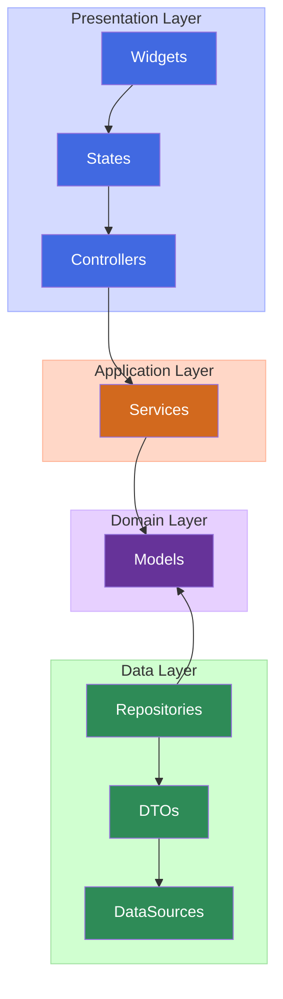

# コーデングスタイル(Flutter)

## アーキテクチャ



## ディレクトリ構成

Flutter + Riverpod + Melos + Flavor 対応のディレクトリ構成

```
app/lib/
│── config/                    # 🔧 フレーバーごとの設定
│   ├── environment.dart       # enum Environment { dev, staging, prod }
│   ├── flavor_config.dart     # FlavorConfigクラス（各環境の設定モデル）
│   └── flavor_values/         # 実際の設定値ファイル群
│       ├── dev_values.dart
│       ├── staging_values.dart
│       └── prod_values.dart
│── core/                      # 🧱 アプリ全体の共通処理
│   ├── constants/             # 定数
│   ├── exceptions/            # 共通例外
│   ├── extensions/            # StringやDateTime等の拡張
│   ├── providers/             # グローバルProvider（例：locale、themeなど）
│   ├── services/              # Firebaseや外部APIのラッパー
│   ├── theme/                 # アプリ共通のスタイル設定
│   └── utils/                 # 汎用ロジック（価格フォーマット等）
│── components/                # 🎨 共通UIコンポーネント（ボタン、ダイアログ等）
│── features/                  # 🧩 機能ごとの分離構成（feature-first）
│   ├── auth/                  # 認証（匿名・Google・Apple）
│   │ ├── data/                # データレイヤ(Repository/DTO/DataSource)
│   │ ├── domain/              # ドメインレイヤ(Model)
│   │ ├── application/         # アプリケーションレイヤ(UseCase)
│   │ └── presentation/        # プレゼンテーションレイヤ(View/State/Controller)
│   ├── purchase/              # プレミアム課金・購入・復元
│   ├── settings/              # 言語切替・規約リンク・ログアウト等
│   └── ...
│
│── l10n/                      # 🌍 多言語対応（slang使用）
│── routing/                   # 🚦 go_routerベースの画面遷移設定
└── main.dart                  # 🚀 エントリーポイント（flavor init含む）
```

## 利用ライブラリ

- 状態管理:
  - [riverpod](https://pub.dev/packages/riverpod)
  - [hooks_riverpod](https://pub.dev/packages/hooks_riverpod)
- データクラス:
  - [freezed](https://pub.dev/packages/freezed)
  - [json_serializable](https://pub.dev/packages/json_serializable)
- 多言語対応:
  - [slang](https://pub.dev/packages/slang)
- コード生成:
  - [build_runner](https://pub.dev/packages/build_runner)
  - [flutter_gen](https://pub.dev/packages/flutter_gen)
- ルーティング:
  - [go_router](https://pub.dev/packages/go_router)
  - [go_router_builder](https://pub.dev/packages/go_router_builder)
- ロギング:
  - [takler](https://pub.dev/packages/talker)
- lint:
  - [custom_lint](https://pub.dev/packages/custom_lint)
  - [riverpod_lint](https://pub.dev/packages/riverpod_lint)
- 決済/マネタイズ:
  - [purchases_flutter](https://pub.dev/packages/purchases_flutter)
  - [google_mobile_ads](https://pub.dev/packages/google_mobile_ads)
- その他:
  - shared_preferences
  - google_fonts
  - flutter_animate

## 共通基盤

## 認証

- 認証はFirebase Authを用いる
- 認証中かどうかの判断は、Firebase Authの認証状態を用いる

## エラーハンドリング

- AppExceptionクラスを使用した例外処理
- handleError関数を使用した例外の変換
- Crashlyticsを使用したクラッシュレポート

## ロギング

- Talkerを使用したロギング
- Crashlyticsへのログ送信
- デバッグモードでのログ表示
